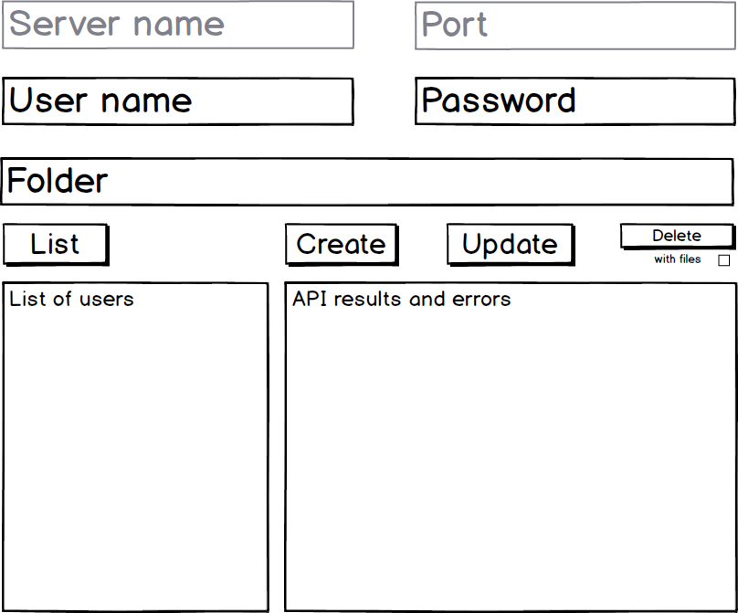

## f-storage test project

- [Client side Gui](#client-side-gui)
- [Server side Gui](#server-side-gui)
- [Threading model](#threading-model)
- [Software layers](#software-layers)
- [Error handling](#error-handling)
- [Life time span](#life-time-span)
- [Protocol](#protocol)
- [Security concerns](#security-concerns)
- [Other concerns](#other-concerns)
- [Coding convention](#coding-convention)
- [Deployment](#deployment)
- [Project structure](#project-structure)
- [Programming to interfaces](#programming-to-interfaces)
- [Third parties](#third-parties)
- [Unit tests](#unit-tests)
- [High level design](#high-level-design)
- [Class level design](#class-level-design)


### Client side GUI


### Server side GUI


### Threading model
The essence of this project is IO bounded operations
- Communication over Tcp
- Files read/write operations
- Data base read/write operations 

So the Async/Await programing model seems to be a good choice. All operations are started as asynchronously. The only concern is to serialize GUI actions.

### Software layers
- GUI server / client
- TCP proxying
- Server side business logic
- Data access layer
- Utilities

### Error handling
The trade off here is between robust error handling and simplicity of a prototype project.
The following model is implemented
- C# exceptions are used as error handling whenever it is possible
- GUI wraps any exception and logs it to result view
- Server side exceptions are serialized and then re-thrown on client side

### Life time span
Trade-off: re-using of an open connection vs simple programing model
- A new TCP connection is open per server request
- Data base connection is reused
- On server life span of objects is as application
- On client life span of objects is as requests

### Protocol
- Request and response are transferred as json
- Each request has its own protocol
- File content is transferred as binary bites

### Other concerns 
- 

### Coding convention
- Explicit interface implementation
- Pascal case for public symbols
- Camel case for private symbols

### Deployment
- Project is deployed through GitHub release features
- Just download binaries and run it with the dotnet command

### Project structure
- f-client - client GUI 
- f-server - server Gui
- f-core - infrastructure and business logic of both client and server
- f-nunit - unit tests

### Programming to interfaces
- All POCO classes have no behaviors
- All behaviors are encapsulated as interfaces

### Security concerns
- SQL injection is prevented in data access layers
- Passwords are transferred and stored as SHA
- Each transaction has its own authentication

### Third parties
- Json.Neton - json serialization
- SQLite - data access
- NUnit - unit testing

### Unit tests
- There is lack of unit tests as it is a prototype project

### High level design


### Class level design

``` csharp
interface IServer {
    void AddUser(string userName, string password, string folder);
    void RemoveUser(string userName);
    void UpdatePassword(string userName, string password);
}
```

``` csharp
interface IClient {
    string[] ListFiles(SrvRequest request);
    void Upload(SrvRequest request, string srcPath);
    void Download(SrvRequest request, string fileName, string dstFolder);
    void Delete(SrvRequest request, string fileName);
}
```