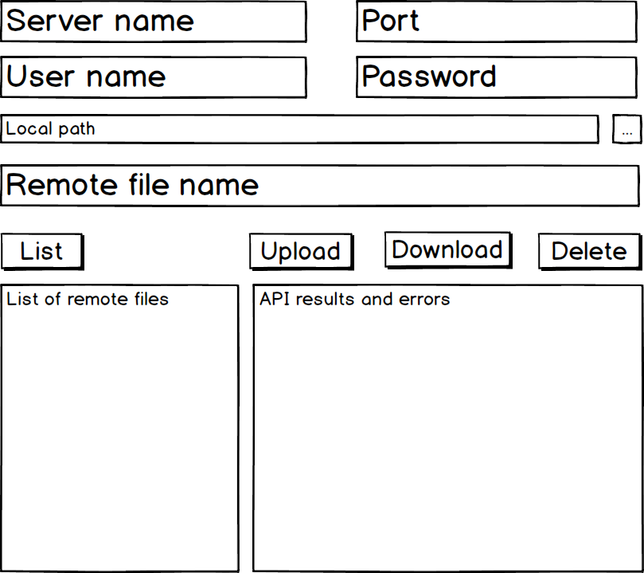
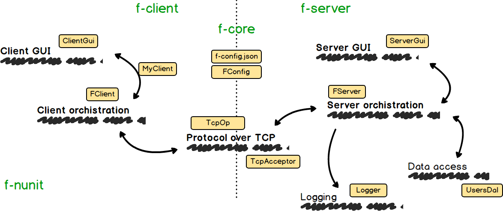

# f-storage test project

- [Deployment](#deployment)
- [Client side Gui](#client-side-gui)
- [Server side Gui](#server-side-gui)
- [High level design](#high-level-design)
- [Software layers](#software-layers)
- [Protocol](#protocol)
- [Threading model](#threading-model)
- [Error handling](#error-handling)
- [Life time span](#life-time-span)
- [Coding convention](#coding-convention)
- [Project structure](#project-structure)
- [Programming to interfaces](#programming-to-interfaces)
- [Security concerns](#security-concerns)
- [Third parties](#third-parties)
- [Unit tests](#unit-tests)

---

## Deployment

- Project is deployed through GitHub release features
- Just download binaries and run it with the dotnet command
- Server: `f-server.exe`
- Client: `f-client.exe`
- Log file: `f-server.log`
- Sqlite DB: `f-storage.db`

---

### Client side GUI

---

### Server side GUI

---

### High level design

---

### Software layers

---

### Protocol

- Requests and responses are transferred as json
- Each request type has its own protocol
- File content is transferred as binary stream

---

### Threading model

The essence of this project is IO bounded operations
- Communication over Tcp
- Files read/write operations
- Data base read/write operations 

So the Async/Await programing model seems to be a good choice. All operations are started as asynchronously.

### Error handling

The trade off here is between robust error handling and simplicity of a prototype project.

The following model is implemented
- C# exceptions are used as an error handling whenever it is possible
- GUI wraps any exception and logs it to the result view
- Server side exceptions are serialized and then re-thrown on the client side

### Life time span

Trade-off: re-using of an open connection vs simple programing model
- A new TCP connection is open per server request
- A Database connection is reused
- On server side life span of objects is as application life span
- On client life span of objects is as a request life span

### Coding convention

- Explicit interface implementation
- Pascal case for public symbols
- Camel case for private symbols

### Project structure
- f-client - client GUI 
- f-server - server Gui
- f-core - infrastructure and business logic of both the client and the server
- f-nunit - unit tests

### Programming to interfaces

- All POCO classes have no behaviors
- All behaviors are encapsulated as interfaces

### Security concerns

- SQL injection is prevented in data access layers
- Passwords are transferred and stored as Sha256
- Each transaction has its own authentication

### Third parties

- Json.Neton - json serialization
- SQLite - data access
- NUnit - unit testing

### Tests

- There are two integration tests
- There is lack of unit tests as it is a prototype project

